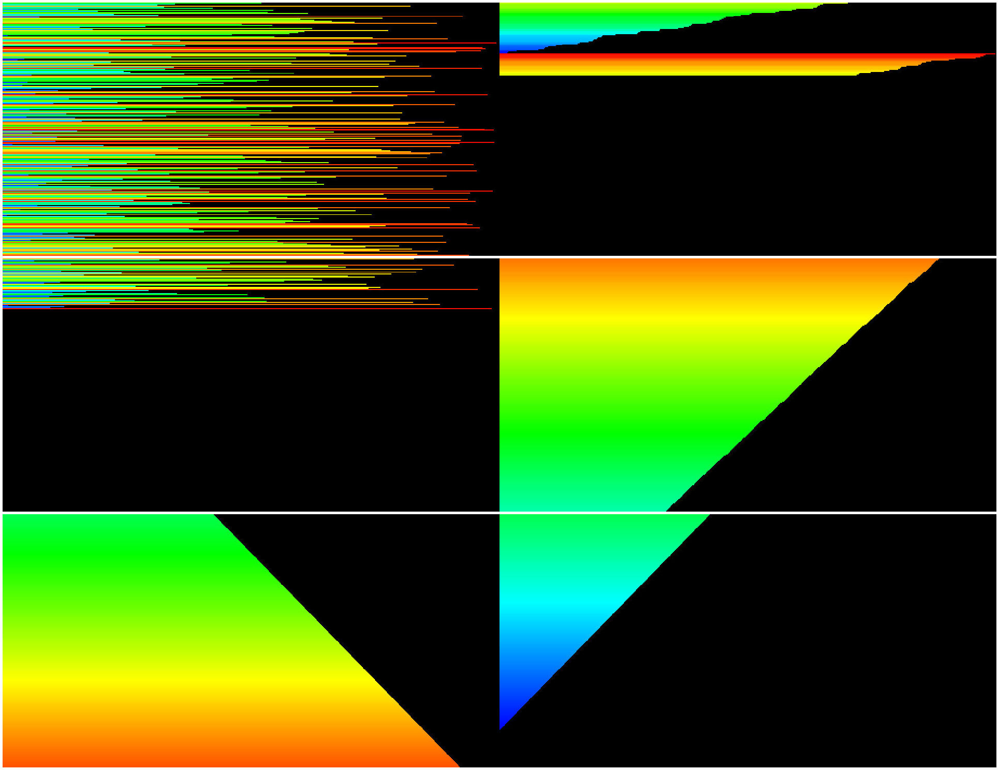
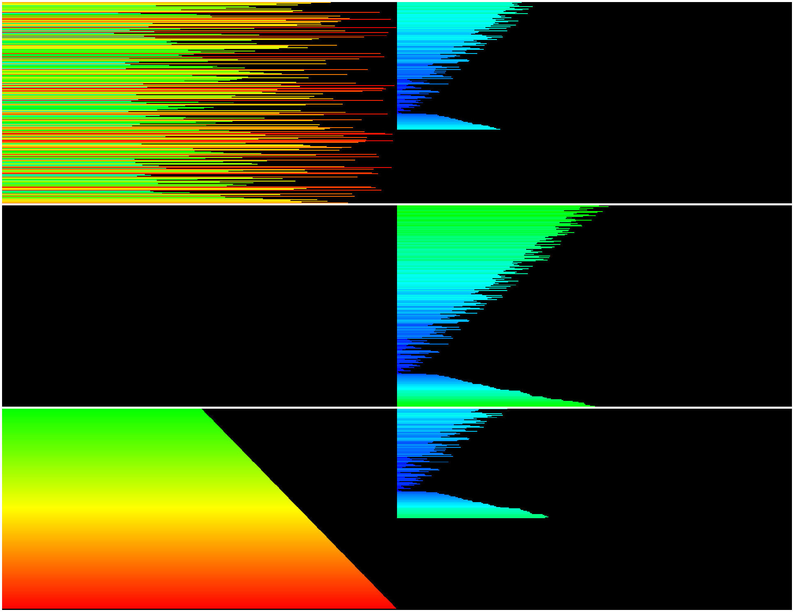
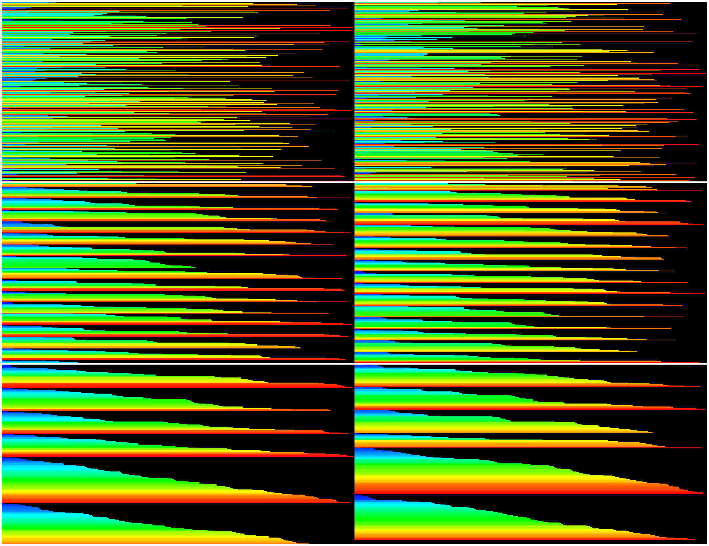

*This project has been created as part of the 42 curriculum by urkamins, pausulzy.*

## # Table of Contents
- [Description](#description)
- [Instructions](#instructions)
    - [Prerequisites](#prerequisites)
    - [Clone the Repository](#clone-the-repository)
    - [Compile the program](#compile-the-program)
    - [Usage](#usage)
    - [Cleanup](#cleanup)
- [Resources](#resources)
- [Algorithms](#algorithms)
    - [Simple Sort](#simple-sort)
    - [Medium Sort](#medium-sort)
    - [Complex Sort](#complex-sort)
    - [Adaptive Sort](#adaptive-sort)

## Description

Push_swap sorts integers using two stacks and a limited set of operations. The
goal is to produce the shortest possible sequence of moves.

- **Push** (pa, pb) - takes the value on top of one stack and places it on to of the opposite stack.
- **Swap** (sa, sb, ss) - swaps order of the first two values at the top of the stack.
- **Rotate** (ra, rb, rr) - shifts the stack up, sending its first value to the bottom.
- **Reverse rotate** (rra, rrb, rrr) - brings the bottom value back to the top.

## Instruction
### Prerequisites
Ensure you have the following installed on your system:

- C Compiler (e.g., GCC)
- Make

### Clone the Repository
Clone the libft repository to your local machine:

```bash
git clone <url> pushswap
```

### Compile the program
Navigate to the pushswap directory and use the provided Makefile to compile the program:

```bash
cd pushswap
make
```

This command will compile the source files and create both the **libft.a** library and push_swap executable.

### Usage

Run the program with a list of distinct integers. Options must come before the numeric arguments:

```bash
./push_swap [OPTIONS] INTEGERS
```

Available optional flags:

- `--simple`, `--medium`, `--complex` - select a specific sorting algorithm;
- `--adaptive` - choose an algorithm based on input disorder (default);
- `--bench` - print disorder, algorithm information and operation statistics to stderr.

Examples:

```bash
./push_swap 7 4 9 2 1
./push_swap --complex --bench 7 4 9 2 1
```

### Cleanup
If needed, you can clean the generated files using:

```bash
make clean
```
This removes the object files but keeps the compiled library, **libft.a**, and executable, **push_swap**.
To remove both object files and the library/executable, use:

```bash
make fclean
```

## Resources
- [Stack implementation with linked lists](https://medium.com/@dev.siddiquee/stack-implementation-with-singly-linked-list-a-guide-e9fa2b1aa14a)
- [Sorting algorithms](https://www.programiz.com/dsa/sorting-algorithm)
- [Insertion Sort](https://www.geeksforgeeks.org/dsa/insertion-sort-algorithm/)
- [?](https://)
- [Merge sort](https://www.geeksforgeeks.org/dsa/merge-sort/)
- [Bottom-up merge sort](https://www.baeldung.com/cs/merge-sort-top-down-vs-bottom-up)

## Algorithms

The stacks are implemented as singly linked lists, which support dynamic sizing and avoid shifting other elements when the top is modified.

In the complexity estimates below, 'n' denotes the input size, while the complexity denotes the number of stack operations produced by the program x input size. The stacks require O(n) space for their nodes, while the algorithms use O(1) additional space by relinking the existing nodes.

#### Setting up a visualizer

A [push_swap visualizer](https://github.com/o-reo/push_swap_visualizer) is helpful for monitoring program activity, but requires changing a few things to make sure it works on more modern versions of Ubuntu (disabling one warning and correcting the `cmake` call path). Note, make sure to edit `YOUR_USERNAME` to your actual username:
```bash
git clone https://github.com/o-reo/push_swap_visualizer
cd push_swap_visualizer
sed -i 's/-Werror>$/-Werror -Wno-ignored-attributes>/' src/CMakeLists.txt
export PATH=/usr/bin:/home/<YOUR_USERNAME>/.local/bin:$PATH
mkdir build
cd build
cmake ..
make
```
The resulting **push_swap_visualizer/build/bin** directory contains the visualizer files. Copy the folder to where the compiled **push_swap** program resides, and run it via `./visualizer`. There will be three settings tables: *Controls*, *Values*, and *Commands*. They might be overlapping, so just move the top one around to see if there's another underneath, then use the *Scale UI* bar to resize them. These table positions (but not resizing settings) will be saved in the **imgui.ini** file for next use.

In the *Values* container, enter a number into the *Count* input and click *Shuffle*, or enter your own list into the *Values* input. Ensure the the correct `../push_swap` file path is entered and select *Compute*. Now, in the *Controls* box, click *Start* to commence the visualization, and controlling *Speed* and playback actions as needed while it runs.

### Simple Sort

Simple sort inserts each of the n values into `stack_b`. Finding the correct position may require up to n rotations per value, giving O(n²) operations in the worst/avg case and O(n) in the best case. Insertion sort was chosen because it requires fewer moves on nearly sorted input. With an input of small disorder, successive values usually belong close to their final position, which limits the number of required rotations.

1. Move the first value from `stack_a` to `stack_b` and keep the current maximum in memory.
2. For each remaining value in `stack_a`, find its insertion position (more than next value, less than the previous one) in `stack_b`.
3. Rotate `stack_b` in the shorter direction, push the current value from `stack_a` and update the
   maximum value if necessary.
4. Once `stack_a` is empty, rotate `stack_a` until its maximum is on top (`stack_b` is kept in descending order).
5. Push every value back to `stack_a`, leaving it in ascending order.


*Visualizer of this insertion sort in three phases, passing values first to the second stack, then showing the second stack and its near-organized state a little before its return run, and finally showing the returning of the values to a final organized state to the original stack.*

### Medium Sort
Butterfly sort was chosen because it introduced some clever optimization hacks. Values are analyzed via rank on `stack_a` in bottomless, expanding chunks, and then acted upon based on what category they fall into:

- Small, within chunk: pushed to the bottom of `stack-b`
- Large, within chunk: pushed to the top of `stack_b`
- Very large, outside chunk range: rotated to the bottom of `stack_a`

This renders an hourglass, "butterfly" `stack_b` containing all values at the end of this first phase. The values are then returned in the second phase to `stack_a` naturally processed in their resulting chunks, with `stack_b` rotating to pop values from both ends and laying the largest ones down onto `stack_a` first, slowly eating its way to the smaller values contained within the middle of the hourglass.

A helpful metaphor involves imagining a teacher sorting a hundred exams by grade. They start by flipping through all exams and pulling out all results from 0-9%, putting the ones 4% and lower at the bottom of a new stack, and those from 4-9% at the top. If any exam is higher than 9%, it's just moved to the end of the original stack. They then follow through with 10-19%, 20-29%… 80-89%, 90-100%, and are left with a stack of exams sorted by unorganized, 10% "chunks", each of which is easy to organize through a second pass.

The butterfly sort implemented here is different because it uses the hack of an expanding chunk window, which would be hard for the teacher to implement but a computer can so it quite easily.

A final note about chunk window size: this was chosen simply through trial and error, as the numbers `15` and `30` worked well with the anticipated tests listed in the project outline.


*Visualizer of this butterfly sort showing the first pass ongoing, then the first pass complete and achieving its namesake shape, and lastly the second pass ongoing, nearing completion.*

### Complex Sort

Complex sort is implemented as a bottom-up merge sort algorithm. Each iteration doubles the processed run size, hence the target complexity is of O(n log n). The bottom-up variant allows the merge direction to alternate between `stack_a` and `stack_b` as it goes from run size of one to run size of the initial stack size.

General steps:
1. Split the input evenly between stacks to form the initial runs.
2. Take one run from each stack and merge their values in order into the
   destination stack.
3. Double the run size after each full iteration.
4. Repeat the merge until one sorted run of size(`stack_a`) remains.


*Visualizer of this bottom-up merge sort cascading values into increased order at three subsequent intervals as the program runs, swapping values back and forth between stacks.*

### Adaptive Sort

Adaptive sort chooses appropriate soring strategy based in the input disorder. Disorder is a number between 0 and 1 that tells how far the input is from being sorted.
It uses:
 - simple sort up to 20%
 - medium sort below 50%
 - complex sort for more than 50%
of estimated input disorder.

---
